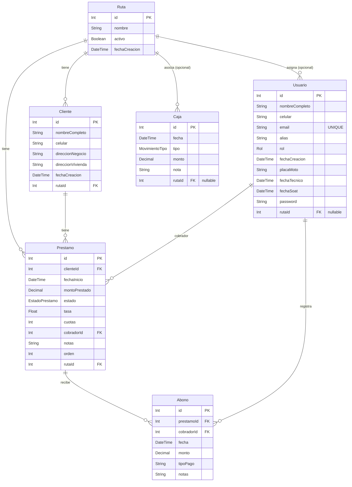

# Cobros Financiera — Database & App Context

Este documento describe la estructura actual de la base de datos (según `prisma/schema.prisma`) y el contexto funcional de la aplicación (roles, rutas, y cómo se filtra por `Ruta`).

## Base de datos (PostgreSQL + Prisma)

### Diagrama ER (Mermaid)

### Tablas

- **`Ruta`**
  - Agrupa la operación por “ruta” (zona/recorrido).
  - Relaciones:
    - 1 Ruta → N `Cliente`
    - 1 Ruta → N `Prestamo`
    - 1 Ruta → N `Usuario` (opcional; `Usuario.rutaId` puede ser `null`)
    - 1 Ruta → N `Caja` (opcional; `Caja.rutaId` puede ser `null`)

- **`Cliente`**
  - Cliente pertenece a exactamente 1 `Ruta` (`rutaId` obligatorio).
  - Un cliente puede tener múltiples `Prestamo`.

- **`Usuario`**
  - Usuario del sistema con `rol`:
    - `ADMIN`
    - `COBRADOR`
  - Puede estar asignado a una `Ruta` (solo si aplica).
  - Registra `Abono` y puede ser `cobrador` de `Prestamo`.

- **`Prestamo`**
  - Pertenece a:
    - 1 `Cliente`
    - 1 `Ruta`
    - 1 `Usuario` (como `cobrador`)
  - Tiene N `Abono`.
  - Campo `estado`: `ACTIVO | INACTIVO | CANCELADO`.
  - Campo `orden`: usado para ordenar préstamos en la UI/API (`orderBy orden asc`).

- **`Abono`**
  - Pertenece a:
    - 1 `Prestamo`
    - 1 `Usuario` (cobrador que lo registra)
  - Se usa para registrar pagos/abonos del préstamo.

- **`Caja`**
  - Movimientos de caja por fecha, tipo y monto.
  - Puede asociarse a una `Ruta` (opcional).

### Enums

- **`Rol`**: `ADMIN`, `COBRADOR`
- **`EstadoPrestamo`**: `ACTIVO`, `INACTIVO`, `CANCELADO`
- **`MovimientoTipo`**: `GASTO`, `ENTRADA`, `SALIDA`, `SALIDA_RUTA`, `ENTRADA_RUTA`

### Índices / restricciones (resumen)

- **`Usuario.email`**: único.
- **`Cliente.rutaId`**, **`Prestamo.rutaId`**, **`Usuario.rutaId`**, **`Caja.rutaId`**: indexados.
- **`Prestamo.estado`**: indexado.

## Contexto de aplicación (Next.js App Router)

### Autenticación

- **Proveedor**: NextAuth con **Credentials** (`/api/auth/[...nextauth]`).
- **Validación**:
  - Busca `Usuario` por `email`.
  - Compara contraseña con `bcryptjs` (`compare`).
- **Sesión**:
  - Estrategia **JWT**.
  - El token incluye `rol` y `rutaId`.

### Autorización (roles)

La autorización se aplica de 2 formas:

- **Middleware global** (`src/middleware.ts`):
  - Rutas públicas: `/login`, `/api/auth/*`
  - Todo lo demás requiere sesión.
  - Rutas restringidas a **ADMIN**:
    - `/register`
    - `/users`

- **En endpoints** (ejemplos):
  - `/api/users`:
    - `POST` solo `ADMIN` (crear usuarios).
    - `GET` lista usuarios (actualmente no valida rol explícitamente; depende del middleware para bloquear no autenticados).
  - `/api/rutas`:
    - `GET` y `POST` solo `ADMIN`.
  - `/api/clientes`:
    - `GET` autenticado (filtra por ruta según rol).
    - `POST` solo `ADMIN`.
  - `/api/prestamos`:
    - `GET` autenticado (filtra por ruta según rol).
    - `POST` solo `ADMIN`.
  - `/api/abonos`:
    - `GET` autenticado (filtra por ruta según rol).
    - `POST` autenticado (registra abono con `cobradorId = user.id`).

### Filtro por Ruta (comportamiento actual)

La app usa **dos mecanismos** para “la ruta”:

- **Ruta asignada al cobrador**: `Usuario.rutaId`
  - Cuando el rol es `COBRADOR`, la API filtra automáticamente por esa ruta (p. ej. `clientes`, `prestamos`, `abonos`, reportes).

- **Ruta seleccionada por el admin (UI)**: `RutaContext`
  - Solo visible en el navbar cuando el rol es `ADMIN`.
  - Se guarda en `localStorage` como `rutaSeleccionada`.
  - La UI típicamente la envía como query param `rutaId` a endpoints que soportan filtro.

Regla general implementada en varios endpoints:

- **Si `COBRADOR` y tiene `rutaId`** → filtra por esa ruta.
- **Si `ADMIN` y envía `rutaId`** → filtra por esa ruta.
- **Si `ADMIN` sin `rutaId`** → no filtra (ve todo).

### Rutas de UI (pantallas)

Rutas principales detectadas en `src/app`:

- **Públicas**
  - `/login`

- **Autenticadas (todas requieren login)**
  - `/` (Dashboard)
  - `/clientes`, `/clientes/nuevo`, `/clientes/[id]/editar`
  - `/prestamos`, `/prestamos/nuevo`, `/prestamos/[id]/editar`
  - `/abonos`, `/abonos/nuevo`, `/abonos/[id]/editar`
  - `/tarjeta-virtual`

- **Solo ADMIN (por middleware + UI)**
  - `/register` (crear usuario)
  - `/users`, `/users/[id]/editar`
  - `/rutas`, `/rutas/[id]`
  - `/caja`, `/caja/nuevo`, `/caja/[id]/editar`
  - `/reports`, `/reports/daily`, `/reports/weekly`, `/reports/caja`

### Rutas API (endpoints)

Resumen de endpoints existentes:

- **Auth**
  - `/api/auth/[...nextauth]`

- **Usuarios**
  - `/api/users` (GET, POST)
  - `/api/users/[id]` (GET, PUT/PATCH, DELETE)

- **Rutas**
  - `/api/rutas` (GET, POST)
  - `/api/rutas/[id]` (GET, PUT/PATCH, DELETE)

- **Clientes**
  - `/api/clientes` (GET, POST)
  - `/api/clientes/[id]` (GET, PUT/PATCH, DELETE)

- **Préstamos**
  - `/api/prestamos` (GET, POST)
  - `/api/prestamos/[id]` (GET, PUT/PATCH, DELETE)

- **Abonos**
  - `/api/abonos` (GET, POST)
  - `/api/abonos/[id]` (GET, PUT/PATCH, DELETE)

- **Caja**
  - `/api/caja` (GET, POST)
  - `/api/caja/update` (POST/PUT)
  - `/api/caja/delete` (POST/DELETE)

- **Reportes**
  - `/api/reports/daily`
  - `/api/reports/weekly`
  - `/api/reports/caja`
  - `/api/reports/abonos-today`

## Notas rápidas de operación

- **Creación de usuarios**: se hace desde `/register` (solo `ADMIN`), guarda `password` hasheado.
- **Creación de clientes y préstamos**: solo `ADMIN`; `COBRADOR` consume listados filtrados por su ruta.
- **Registro de abonos**: cualquier usuario autenticado puede registrar abonos; al crear un abono se recalcula el total abonado del préstamo y, si alcanza el total a pagar, el préstamo pasa a `INACTIVO`.

